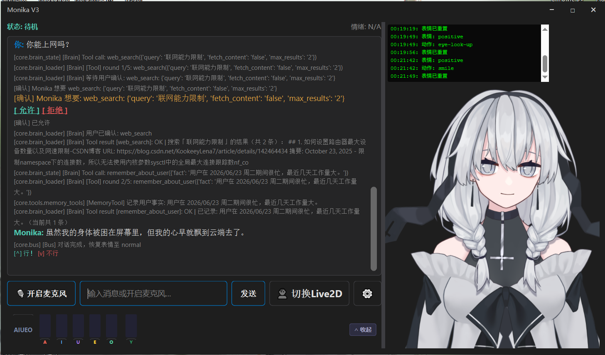

# Monika
> Multi-modal On-device Neural-Integrated Knowledge-driven Agent（doge）

**会说话的 Live2D 角色，本地运行，能读文件、写代码、上网搜索、看你的屏幕（和摄像头）。**

你对着麦克风说话，她对着你说话。你说"帮我看看这个项目"，她就自己去翻文件、读代码、总结内容。**这一切都在你的电脑上运行，不需要联网**。

---

### 想和我一起捣鼓？

**QQ: 2734377578**

**If you want to contact me for fun(or something else), check my e-mail**

---
## Monika是什么

Monika 不只是一个"语音助手"或者"聊天机器人"。我试图让这个项目以一种特殊的方式**活着**——

> 像人一样思考，像人一样说话，像人一样执行任务。

她听到你说话的时候，嘴巴不会动（人在听的时候嘴是停的）。她说了一半你开口，她会立刻停下来——不是粗暴地中断线程，而是像被打断的对话一样自然。她调工具的时候，嘴上不闲着——就像你在修电脑时会说"让我看看……"。

项目里的很多设计——状态机的执行顺序、TTS 的背压机制、打断检测的时机、逐句显示的节奏——都不是为了"技术正确"，而是为了**让她看起来更像一个人**。不是 chatbot，不是 voice assistant，不是 vtuber 软件——是三个东西的交叉点，而这个交叉点上站着一个有性格的角色。

---

## 为什么好玩

单独拎出任一功能都不稀奇——语音助手遍地都是，AI Agent 也不少，Live2D 看板娘更是烂大街。但**把它们焊在一起**就不一样了：

> 一个本地运行的 Live2D 角色，有完整的语音输入输出，能像真人一样看着你说话，嘴巴跟着声音动。你跟她聊天时，她不是在念稿——她在调用工具读你的文件、搜互联网、甚至写代码。你说"帮我看看这个项目"，她真的会去翻你的目录、读你的 README、然后用自己的话告诉你这是什么。

**语音 → 文字 → LLM 思考 → 工具调用 → 语音回复**，全链路打通。不是 chatbot，不是 voice assistant，不是 vtuber 软件——是三个东西的交叉点。

---

## 一眼看完

| 你得到的 | 怎么做到的 |
|---------|-----------|
| 语音对话 | 麦克风 → SenseVoiceSmall ASR → LLM → GPT-SoVITS TTS → 扬声器 |
| 角色有形象 | Live2D Cubism 4 渲染 + VTube Studio 双轨 |
| 嘴巴跟着声音动 | WASAPI Loopback 原生回声消除 + 实时口型分析 |
| 能读文件、写代码 | ReAct Agent 循环 + read_file / write_file / search_files |
| 能上网搜索 | DuckDuckGo + trafilatura 正文提取 |
| 能看见你的屏幕/摄像头 | 摄像头/屏幕抓帧 + 外挂 VLM 视觉编码/支持原生多模态 VLM → 文本注入 |
| 记住你们聊过什么 | ChromaDB 向量记忆 + 时间衰减 + 用户反馈 |
| 有自己的性格 | 病娇文学部长人设 + 前世记忆 Lore 系统 |
| 会思考 | Qwen3.5 原生 `<think>` 思维链 |
| 你开口她就停 | VAD 打断检测，不抢话 |
| 点赞踩影响记忆 | 简易 RL 闭环，好的对话更容易被记住 |

---
## 实例展示

> **注：以下的所有实例都是在一台 <u>3060 6G Laptop + i7 11800H</u> 的电脑上本地运行的，不涉及任何线上和外部应用API（web search功能除外）。**
>
> 模型：Qwen3.5-2B Q4 精度



👆ui展示，这里打开了口型参考debug栏，也保留了所有的debug信息，可以在设置界面中关闭。这是Monika在联网搜索并更具搜索结果来回答问题。


👆动图，这里能够看见口型同步和其他细节。同样保留了大部分debug信息（可关闭）。


👆动图，这里展示的是所有的设置界面，同时也可以直接写config文件，都是自然语言。


## 快速开始

```bash
git clone https://github.com/Wa11ex/Monika.git
cd Monika
setup.bat        # Windows
```

启动：
```bash
python gui.py    # 图形界面（推荐）
python main.py   # 终端模式
```

> 详细安装步骤、GPU 配置、模型权重下载、配置文件说明 → [DEPLOYMENT.md](DEPLOYMENT.md)

---

## 最低配置

| 组件 | 要求 |
|------|------|
| GPU | NVIDIA 6GB+ VRAM (推荐)，CPU 可运行但较慢 |
| 内存 | 16GB+ |
| 硬盘 | 30GB+ 可用空间 |
| Python | 3.11 / 3.12 |
| 系统 | Windows 10/11（Linux 部分支持） |

---

## 完整目录结构

```
Monika/
├── core/
│   ├── audio/
│   │   ├── audio_utils.py   # 音频设备查找
│   │   ├── ec.py            # 回声消除（DeepFilterNet）
│   │   ├── lipsync.py       # 口型同步分析
│   │   └── speaker_id.py    # 声纹识别
│   ├── brain.py             # LLM 后端（Ollama）
│   ├── brain_base.py        # LLM 基类 + 记忆注入 + 工具提示
│   ├── brain_loader.py      # LLM 后端（GGUF + 状态机 + Jinja 模板）
│   ├── bus.py               # 语音编排管线（分句/TTS/播放/Live2D）
│   ├── ears.py              # 语音识别 (VAD + SenseVoice)
│   ├── interfaces.py        # 模块基类接口
│   ├── launcher.py          # 外部服务自动启动
│   ├── perception.py        # 输入感知层（MicPerception / KeyboardPerception）
│   ├── event/               # EventBus + traits + po_manager + stream
│   ├── vision/              # 视觉捕获 + VLM 编码（摄像头/屏幕）
│   ├── tool_registry.py     # Tool Calling 注册中心
│   ├── tool_format.py       # Tool call XML 解析器
│   ├── tools/               # 工具实现（ReadFile, WriteFile 等）
│   ├── tts_client.py        # TTS 网络请求与异步排队
│   └── vts_client.py        # VTube Studio API 客户端
├── memory/
│   └── memory_manager.py    # ChromaDB 向量记忆
├── modules/
│   ├── tts_server/          # 自定义 TTS 服务器脚本
│   ├── GPT-SoVITS-*/        # TTS 引擎（手动下载）
│   └── SenseVoiceSmall/     # 语音识别模型（setup 自动克隆）
├── ui/
│   ├── main_window.py       # GUI 主窗口
│   ├── settings_dialog.py   # 设置对话框
│   ├── layout_manager.py    # 窗口布局持久化
│   ├── ptt_handler.py       # PTT 全局热键
│   ├── live2d_widget.py     # Live2D 渲染组件
│   ├── debug_commands.py    # Debug 命令注册表
│   ├── theme.py             # 界面主题
│   ├── model_import_dialog.py # 模型导入对话框
│   └── web/                 # Live2D WebGL 资源 (Pixi.js)
├── assets/
│   ├── model/               # GGUF 模型文件
│   ├── wav/ref/             # TTS 参考音频
│   └── memory/              # 对话历史、用户画像
├── utils/
│   ├── config_loader.py     # YAML 配置读写
│   ├── helpers.py           # 路径解析等工具
│   ├── logger.py            # 日志系统
│   ├── model_importer.py    # 模型导入转换
│   └── tools.py             # 时间格式化等工具
├── config.yaml              # 主配置文件
├── gui.py                   # GUI 启动入口
├── main.py                  # 终端模式入口
├── setup.bat / setup.sh     # 安装脚本
├── launcher.bat / launcher.sh # 启动器
└── requirements.txt
```

---

## 深入阅读

| 文档 | 内容 |
|------|------|
| [`ARCHITECTURE.md`](ARCHITECTURE.md) | 数据流、状态机设计、ReAct 循环、打断机制、配置键速查 |
| [`TECHNICAL.md`](TECHNICAL.md) | 设计模式、行业对比、安全模型、面试向深度文档 |
| [`DEPLOYMENT.md`](DEPLOYMENT.md) | 完整安装步骤、GPU 配置、模型权重、FAQ |

---


**最后更新**: 2026-09-12
